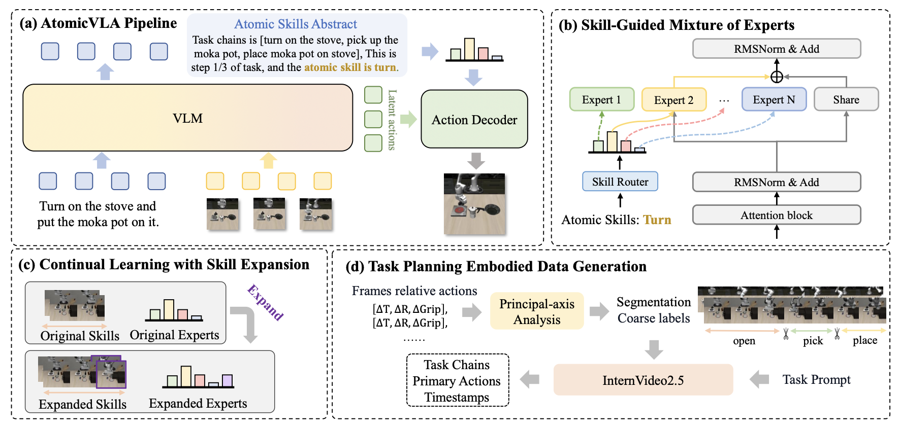

# AtomicVLA: Unlocking the Potential of Atomic Skill Learning in Robots

<p align="center">
<b>CVPR 2026</b>
</p>

<p align="center">
<a href="https://zhanglk9.github.io/atomicvla-web/"></a>
<a href="https://arxiv.org/abs/2603.07648"></a>
<a href="https://github.com/zhanglk9/AtomicVLA"></a>
</p>

<p align="center">
Likui Zhang<sup>1</sup>, Tao Tang<sup>1</sup>, Zhihao Zhan<sup>1</sup>, Xiuwei Chen<sup>1</sup>, Zisheng Cheng<sup>1</sup>, Jianhua Han<sup>3</sup>, Jiangtong Zhu<sup>3</sup>, Pei Xu<sup>3</sup>, Hang Xu<sup>3</sup>, Hefeng Wu<sup>1</sup>, Liang Lin<sup>1*</sup>, Xiaodan Liang<sup>1,2*</sup>
</p>

<p align="center">
<sup>1</sup>Sun Yat-sen University, <sup>2</sup>Peng Cheng Laboratory, <sup>3</sup>Yinwang Intelligent Technology Co. Ltd.
</p>

<p align="center">
<sup>*</sup>Corresponding authors
</p>

## ✨ Abstract

Recent advances in Visual-Language-Action (VLA) models have shown promising potential for robotic manipulation tasks. However, real-world robotic tasks often involve long-horizon, multi-step problem-solving and require generalization for continual skill acquisition, extending beyond single actions or skills. These challenges present significant barriers for existing VLA models, which use monolithic action decoders trained on aggregated data, resulting in poor scalability. To address these challenges, we propose **AtomicVLA**, a unified planning-and-execution framework that jointly generates task-level plans, atomic skill abstractions, and fine-grained actions. AtomicVLA constructs a scalable atomic skill library through a **Skill-Guided Mixture-of-Experts (SG-MoE)**, where each expert specializes in mastering generic yet precise atomic skills. Furthermore, we introduce a flexible routing encoder that automatically assigns dedicated atomic experts to new skills, enabling continual learning. 

## 📢 News
* [2026-05-22] We upload the [ckpt](https://huggingface.co/likui/AtomicVLA-libero) and update code for testing on LIBERO Benchmark.
* [2026-03-10] We release our training code on LIBERO Benchmark.
* [2026-02-22] Our AtomicVLA is accepted by CVPR 2026！


## ⚙️ Setup

We manage Python dependencies with [uv](https://docs.astral.sh/uv/). If you haven't installed `uv`, please follow [uv installation instructions](https://docs.astral.sh/uv/getting-started/installation/) to set it up.

Run the following to set up the environment:

```bash
git clone --recurse-submodules git@github.com:zhanglk9/AtomicVLA.git

# Or if you already cloned the repo:
git submodule update --init --recursive

GIT_LFS_SKIP_SMUDGE=1 uv sync
GIT_LFS_SKIP_SMUDGE=1 uv pip install -e .
```

> **NOTE**: `GIT_LFS_SKIP_SMUDGE=1` is needed to pull LeRobot as a dependency.

> **TIP**: If you prefer using conda to manage the environment, please refer to [INSTALL.md](INSTALL.md) for detailed setup instructions.

For more details, refer to the original [openpi repository](https://github.com/Physical-Intelligence/openpi).

## 🚀 Training

### Data Preparation

1. Download the dataset and place it under `$HF_HOME/` (or set `HF_HOME` to your data directory).
2. Prepare the reasoning annotation JSON (see [📊 Data](#-data) section below).

### Training Commands

To train AtomicVLA on the LIBERO benchmark:

```bash
export WANDB_MODE=disabled
export XLA_PYTHON_CLIENT_MEM_FRACTION=0.9
export CUDA_VISIBLE_DEVICES=0,1,2,3,4,5,6,7

uv run scripts/compute_norm_stats.py --config-name Atomic_libero

uv run scripts/train.py Atomic_libero --exp-name=my_experiment --overwrite

```

## 🖥️ Inference / Deployment

We run inference using a **policy server** and a **hardware client**, following the openpi paradigm.

### Start the Policy Server

```bash
uv run scripts/serve_policy.py scripts/serve_policy.py \
  --port=8000 \
  policy:checkpoint \
  --policy.config="Atomic_libero" \
  --policy.dir="<path_to_your_checkpoint>"
  
```


## 📊 Data

### Atomic Skill Reasoning Annotations

AtomicVLA requires structured reasoning annotations for each demonstration episode. The annotations are stored as a JSON file with the following format:

```json
{
    "0": {
        "all_frames": 214,
        "total_steps": 4,
        "segments": [
            {
                "action_name": "xxx",
                "chain_of_thought": "xxx",
                "primary_action_verb": "pick",
                "start_frame": 0,
                "end_frame": 58,
                "timestamp_formatted": "0 - 58",
            },
            {
                "action_name": "xxx",
                "chain_of_thought": "xxx",
                "primary_action_verb": "place",
                "start_frame": 59,
                "end_frame": 116,
                "timestamp_formatted": "59 - 116",
            },
        ]
    },
```

Each entry maps an episode ID to a list of atomic skill segments, specifying the frame range, the skill type, and optional reasoning text.

## Citation
If you find our work useful, please consider citing:

```bibtex
@misc{zhang2026atomicvlaunlockingpotentialatomic,
      title={AtomicVLA: Unlocking the Potential of Atomic Skill Learning in Robots}, 
      author={Likui Zhang and Tao Tang and Zhihao Zhan and Xiuwei Chen and Zisheng Chen and Jianhua Han and Jiangtong Zhu and Pei Xu and Hang Xu and Hefeng Wu and Liang Lin and Xiaodan Liang},
      year={2026},
      eprint={2603.07648},
      archivePrefix={arXiv},
      primaryClass={cs.RO},
      url={https://arxiv.org/abs/2603.07648}, 
}
```

## Acknowledgements

We express our sincere gratitude to the developers of [openpi](https://github.com/Physical-Intelligence/openpi) for open-sourcing their codebase, to the [InternVideo](https://github.com/OpenGVLab/InternVideo) team for their powerful video understanding model, and to [OneTwoVLA](https://github.com/Fanqi-Lin/OneTwoVLA) for their inspiring work on unified vision-language-action modeling.

## License

This project is licensed under the MIT License. See [LICENSE](LICENSE) for details.
